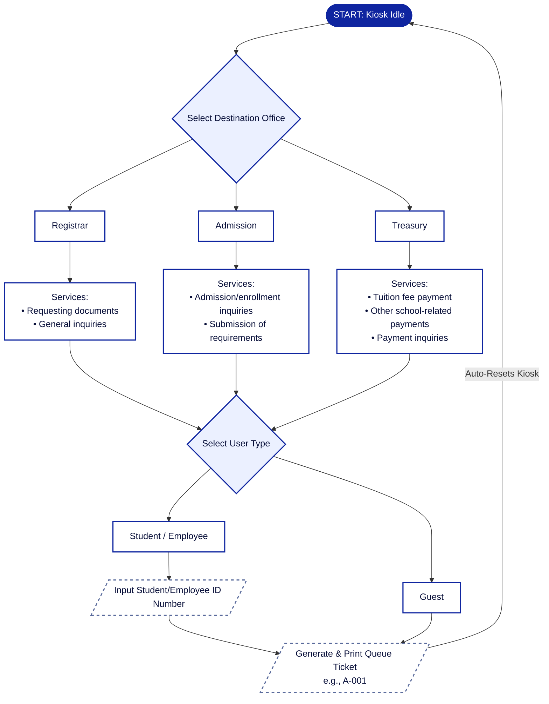
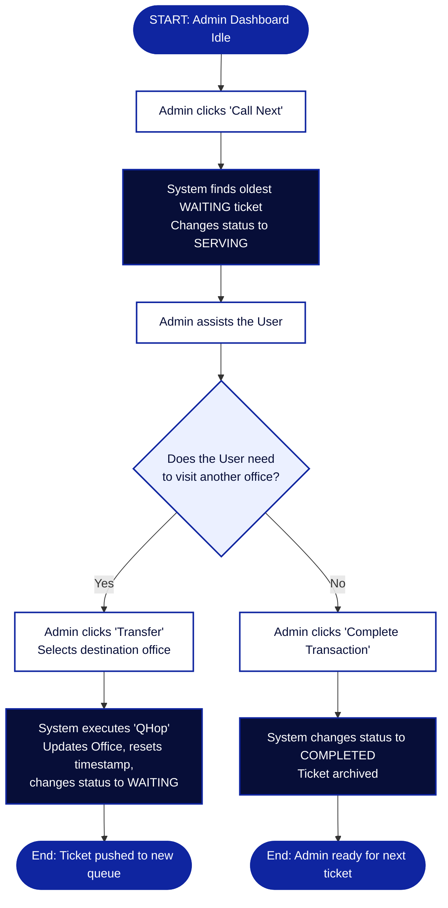

# Q-Hop Management System

The Q-Hop (QueHop) Queue Handling for Office Procedures is a desktop-based queue management system designed to organize student and visitor queues in the school's administrative offices. The system automates the issuance of queue numbers through a kiosk and allows administrative staff to manage the serving process efficiently.

## 🎯 General Objective
To develop a Queueing Management System that organizes student queues and minimizes waiting time within the school's administrative offices, reducing confusion and providing a more efficient queuing experience.

---

## ✨ Features
*   **Automated Queue Generation:** Users can generate a queue number slip directly from a desktop-based kiosk.
*   **Organized Workflows:** Queues are organized according to the selected office and specific requested service.
*   **Queue Flow Management:** Administrative staff can manage the queue flow efficiently, calling the next oldest ticket in the waiting list and completing transactions[cite: 15, 21].
*   **Q-Hop (Transfer Feature):** Staff can transfer a user's ticket to another office seamlessly, resetting their timestamp and placing them in the new queue[cite: 15, 18].
*   **Real-time Tracking:** Displays the current queue number in real time.
*   **Modern UI:** Utilizes smooth transitions and custom Swing components like rounded buttons and panels for an enhanced user experience[cite: 12, 16, 17].

---

## 🏢 Supported Offices & Services
The system currently manages queues for the following three administrative offices[cite: 13, 21]:

### 1. Registrar
*   Requesting documents
*   General inquiries

### 2. Admission
*   Student admission and enrollment inquiries[cite: 21]
*   Submission of admission requirements[cite: 21]

### 3. Treasury
*   Tuition fee payment[cite: 21]
*   Other school-related payments[cite: 21]
*   Payment inquiries[cite: 21]

---

## 👥 System Users
*   Students and Employees[cite: 20, 21]
*   Parents and Visitors (Guests)[cite: 20, 21]
*   Administrative Staff[cite: 21]
*   System Administrators[cite: 21]

---

## 🔄 System Workflows

### Kiosk Workflow
The following diagram illustrates how users interact with the kiosk to generate a queue ticket:

### Admin Workflow
The following diagram illustrates how the admins interact with the tickets generated by the kiosk:

