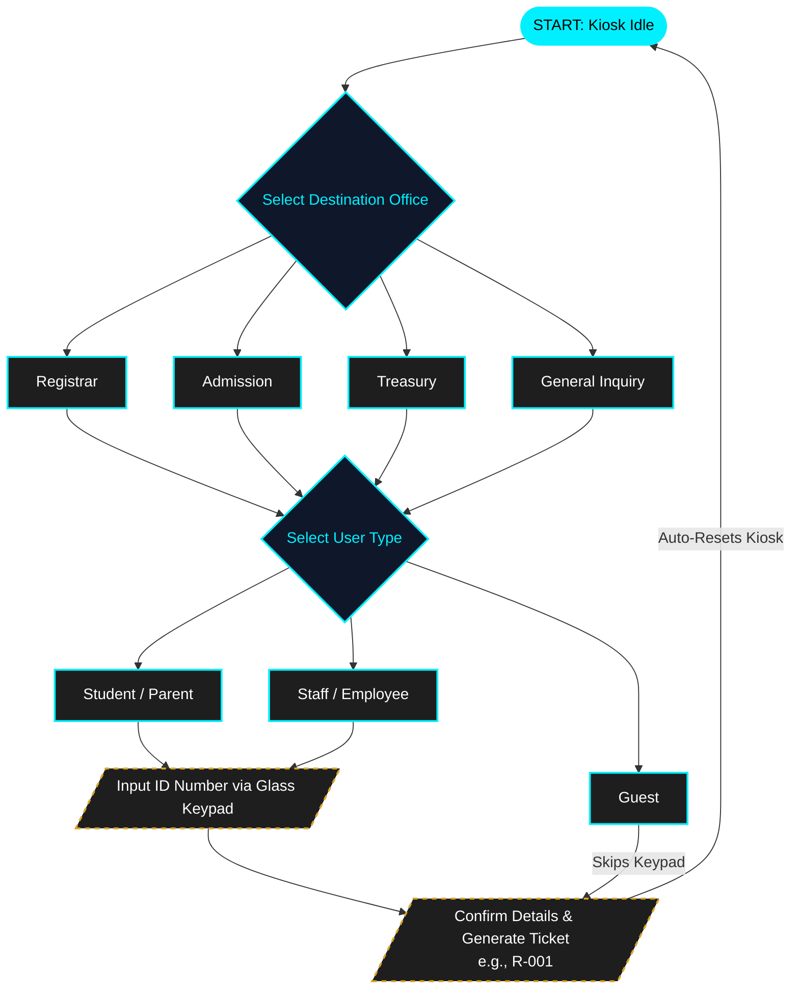
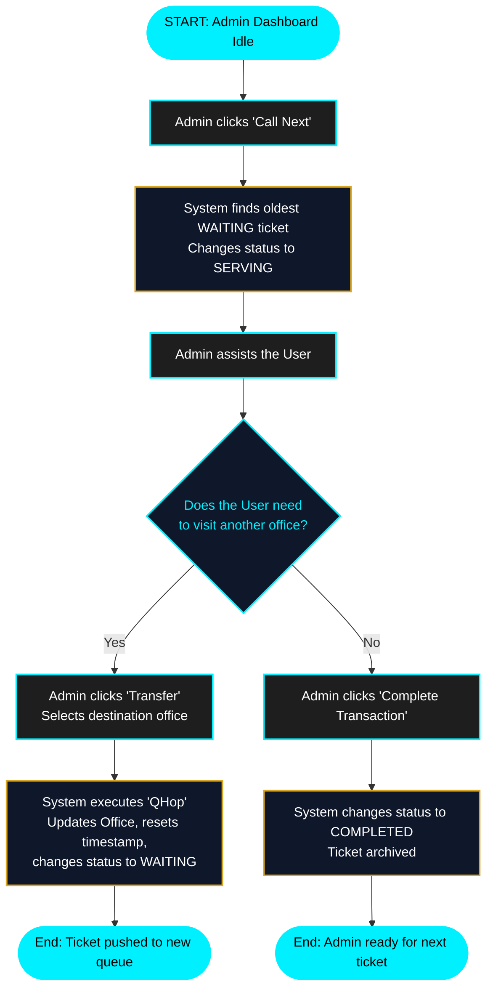

# Q-Hop Management System

The Q-Hop (QueHop) Queue Handling for Office Procedures is a desktop-based queue management system designed to organize student and visitor queues in the school's administrative offices. The system automates the issuance of queue numbers through a sleek kiosk and allows administrative staff to manage the serving process efficiently.

## 🎯 General Objective
To develop a Queueing Management System that organizes student queues and minimizes waiting time within the school's administrative offices, reducing confusion and providing a fast, highly efficient queuing experience.

---

## 💻 Tech Stack
*   **Language:** Java (JDK 17+)
*   **GUI Framework:** Java Swing & AWT
*   **IDE:** Apache NetBeans
*   **Architecture:** Object-Oriented Component-Based UI (`CardLayout` transitions)
*   **Database:** In-Memory Queue Manager *(MongoDB driver integration planned)*

---

## ✨ Features
*   **Automated Queue Generation:** Users can generate a queue number slip directly from a responsive desktop-based kiosk.
*   **Sleek Glassmorphism UI:** Features a modern, hardware-accelerated "Slate & Ice" aesthetic using deep slate-blue backgrounds, high-contrast ice-blue text, and translucent iOS-style glass buttons.
*   **Dynamic Workflows:** Smart navigation logic (e.g., Guests automatically bypass ID keypad entry to speed up queue times).
*   **Queue Flow Management:** Administrative staff can manage the queue flow efficiently, calling the next oldest ticket in the waiting list and completing transactions.
*   **Q-Hop (Transfer Feature):** Staff can transfer a user's ticket to another office seamlessly, resetting their timestamp and placing them at the back of the new queue.
*   **Real-time Tracking:** Displays the current queue number in real time via an in-memory Queue Manager.

---

## 🏢 Supported Offices & Services
The system currently manages queues for the following administrative categories based on the Kiosk dashboard:

### 1. Registrar
*   Requesting documents and academic records.

### 2. Admission
*   Student admission and enrollment processing.
*   Submission of admission requirements.

### 3. Treasury
*   Tuition fee payment and processing.
*   Other school-related transactions.

### 4. General Inquiry
*   General campus questions, payment inquiries, and routing.

---

## 👥 System Users
The system tailors the queue generation process to three specific user categories:
*   **Student / Parent:** Requires ID verification.
*   **Staff / Employee:** Requires ID verification.
*   **Guest:** Expedited queue entry (No ID required).

---

## 🔄 System Workflows

### Kiosk Workflow (User Facing)
The following diagram illustrates how users interact with the kiosk to generate a queue ticket, including the smart-skip logic for guests:

### Admin Dashboard Workflow (Staff Facing)
The following diagram illustrates the queue management process for administrative staff, including the "Q-Hop" transfer feature:

---

## 🚀 Current Development Status
- [x] Backend Object-Oriented Architecture (`QueueManager`, `Ticket` entities)
- [x] Kiosk UI Shell & `CardLayout` Configuration
- [x] Service Selection Screen (Glass UI)
- [x] User Type Selection Screen (Glass UI)
- [x] Hardware-accelerated transitions
- [x] Keypad logic and Guest smart-skip feature
- [ ] Confirmation & Ticket Generation Screen
- [ ] Admin Dashboard UI
- [ ] MongoDB Integration for data persistence
